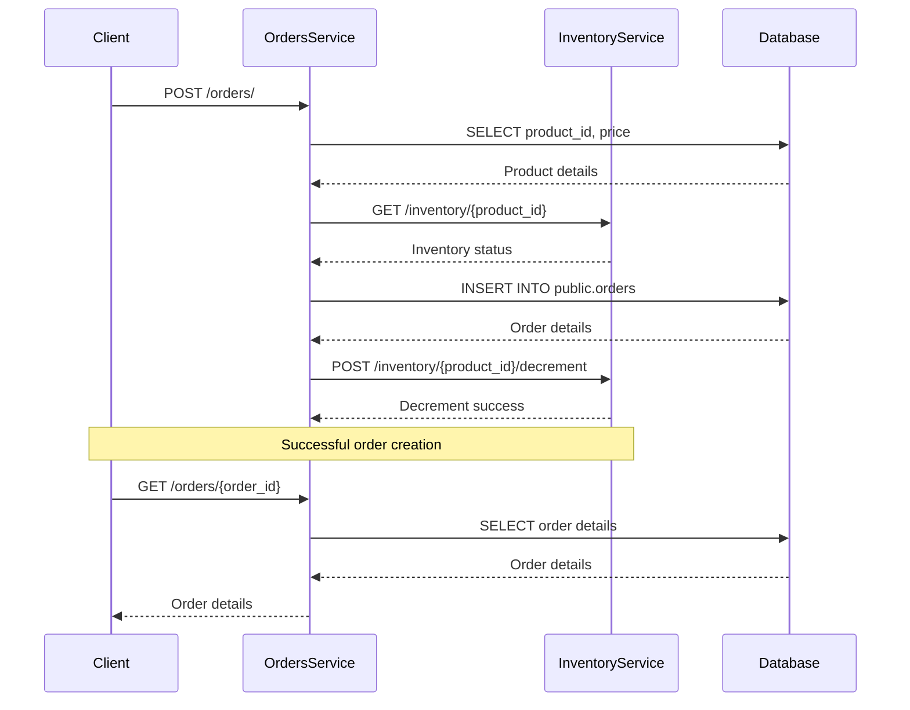

```mermaid
sequenceDiagram
    participant Client
    participant OrdersService
    participant InventoryService
    participant Database

    Client->>OrdersService: POST /orders/
    OrdersService->>Database: SELECT product_id, price
    Database-->>OrdersService: Product details
    OrdersService->>InventoryService: GET /inventory/{product_id}
    InventoryService-->>OrdersService: Inventory status
    OrdersService->>Database: INSERT INTO public.orders
    Database-->>OrdersService: Order details
    OrdersService->>InventoryService: POST /inventory/{product_id}/decrement
    InventoryService-->>OrdersService: Decrement success

    Note over Client, InventoryService: Successful order creation

    Client->>OrdersService: GET /orders/{order_id}
    OrdersService->>Database: SELECT order details
    Database-->>OrdersService: Order details
    OrdersService-->>Client: Order details
```
